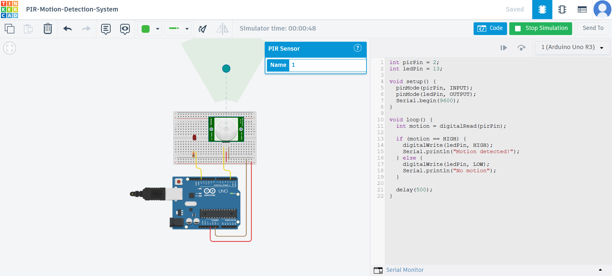

# Arduino Digital & Analog Sensors

## 📌 Project Overview
This project demonstrates the difference between digital and analog sensors using Arduino.

---

## 🔵 Digital Sensor (PIR Motion Detection System)

### 📖 Description
The PIR sensor detects motion and sends a digital signal (HIGH or LOW) to the Arduino.

### ⚙️ Components
- Arduino Uno
- PIR Motion Sensor
- LED
- Resistor
- Breadboard

### 💻 Code
File: pir_motion_detection_system1.ino

### 📷 Circuit

### 🎥 Demo Video
PIR-Motion-Detection-System.mp4

---

## 🟢 Analog Sensor (Potentiometer System)

### 📖 Description
The potentiometer provides analog values (0–1023) to control LED brightness using PWM.

### ⚙️ Components
- Arduino Uno
- Potentiometer
- LED
- Resistor
- Breadboard

### 💻 Code
(To be added)

### 📷 Circuit
(To be added)

---

## 🧠 Key Concepts
- Digital vs Analog signals
- digitalRead() vs analogRead()
- PWM using analogWrite()

---

## 🛠️ Simulation
This project was designed and tested using Tinkercad.
